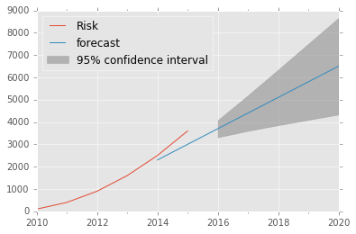

# Curve fitting


 

Accroding to RBI API-581, Inspection plan is developed to determine the risk. Inspection effectiveness is introduced into the POF calculation using Bayesian Analysis, which updates the POF when additional data is gathered through inspection as shown in following equations:
$$R(t, IE) = P(t,IE).CA$$
$$R(t, IE) = P(t,IE).FC$$


## *Proposed Solution*


### Import Libaraies


```python
import pandas as pd
import numpy as np
from statsmodels.tsa.arima_model import ARIMA
```


```python
%matplotlib inline
import matplotlib.pyplot as plt
import matplotlib
matplotlib.style.use('ggplot')
```


```python
import statsmodels.api as sm
```


```python
from datetime import datetime
import time
import math
from time import mktime
```


```python
from sklearn.svm import SVR
```

# Regression Equation

### *Convert Date into int/float*


```python
def convert_sec(s = "2010-12-31 0:0:0"):
    d = datetime.strptime(s, "%Y-%m-%d %H:%M:%S")
    return(time.mktime(d.timetuple()))
```


```python
lst = []
tmp_lst =[]
xint_lst=[]
time_range=pd.DatetimeIndex(start='2010', end='2029', freq='A') 
for i in time_range:
    tmp_lst.append(convert_sec(str(i)))
    
min_val = min(tmp_lst)
max_val = max(tmp_lst)

for i in tmp_lst:
    norm = (i-min_val)/(max_val-min_val)
    lst.append([norm])
    xint_lst.append(norm)
    
# lst
```


```python
risk = [float(i**2) for i in [5,10,15,20,25,30,35,40,45,50]]
# risk = [float(i**2) for i in [5,10,15]]
cur_interval = lst[0:10]
# print cur_interval
```


```python
X = np.sort(cur_interval, axis=0)
X1 = lst[0:len(lst)]
y= np.array(risk)

```


```python
# svr_rbf = SVR(kernel='rbf', C=1e3, gamma=0.2)
# svr_lin = SVR(kernel='linear', C=1e3)
svr_poly = SVR(kernel='poly', C=50e3, degree=2)
# y_rbf = svr_rbf.fit(X, y).predict(X1)
# y_lin = svr_lin.fit(X, y).predict(X1)
y_poly = svr_poly.fit(X, y).predict(X1)
```


```python
risk_target=5000
```

### *convert normailzed date to actual date*


```python
def denorm(norm = 0.4):
    denorm = norm*(max_val- min_val) + min_val
    return denorm
```


```python
def convert_date(timestamp = convert_sec()):
    dt_obj = datetime.fromtimestamp(timestamp)
    return(dt_obj)
```


```python
targ_val = np.interp(risk_target, y_poly, np.array(xint_lst))
```


```python
st= convert_date(denorm(targ_val))
# print str(st)
```

## Draw Chart


```python
lw = 3
plt.scatter(time_range[0:10], y, color='darkorange', label='data')
plt.hold('on')

plt.plot(time_range, y_poly, color='cornflowerblue', lw=lw, label='Quadratic model')

plt.axhline(y=risk_target, color='g',ls='dashed')
plt.axvline(x=time_range[0], color='k',ls='dashed')
plt.axvline(x=time_range[9], color='k',ls='dashed')

plt.axvline(x=convert_date(denorm(targ_val)))

plt.text(x=time_range[0], y=0, s='Installation Date' )
plt.text(x=time_range[9], y=0, s='RBI Date' )
plt.text(x=convert_date(denorm(targ_val)), y=0, s=str(st))
plt.text(x=time_range[0], y=risk_target, s='Target Risk' )

plt.xlabel('Date')
plt.ylabel('Risk')
plt.title('Support Vector Regression')
plt.legend()

plt.show()

```


# Forecasting 


```python
import pandas as pd
import numpy as np
from statsmodels.tsa.arima_model import ARIMA
```


```python
import matplotlib.pyplot as plt
import matplotlib
matplotlib.style.use('ggplot')
```


```python
import statsmodels.api as sm
```


```python
dta = pd.DataFrame({"Risk":[float(i**2) for i in [10,20,30,40,50,60]]})
dta.index = pd.DatetimeIndex(start='2010', end='2016', freq='A')
res = sm.tsa.ARIMA(dta, (1, 1, 0)).fit()

fig, ax = plt.subplots()
ax = dta.ix['2010':].plot(ax=ax)
fig = res.plot_predict('2014', '2020', dynamic=True, ax=ax,
                        plot_insample=False)
plt.show()
```

    D:\DATO\Anaconda2\envs\gl-env\lib\site-packages\statsmodels\tsa\arima_model.py:1847: FutureWarning: TimeSeries is deprecated. Please use Series
      forecast = TimeSeries(forecast, index=self.data.predict_dates)
    





```python
dta = pd.DataFrame({"Risk":[float(i**2) for i in [5,10,15,20,25,30,35,40,45,50]]})
dta.index = pd.DatetimeIndex(start='2010', end='2020', freq='A')
res = sm.tsa.ARIMA(dta, (1, 1, 0)).fit()


fig, ax = plt.subplots()
ax = dta.ix['2010':].plot(ax=ax)
fig = res.plot_predict('2018', '2025', dynamic=True, ax=ax,
                        plot_insample=False)
plt.show()
```


```python

```
